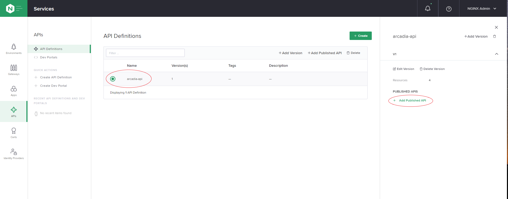
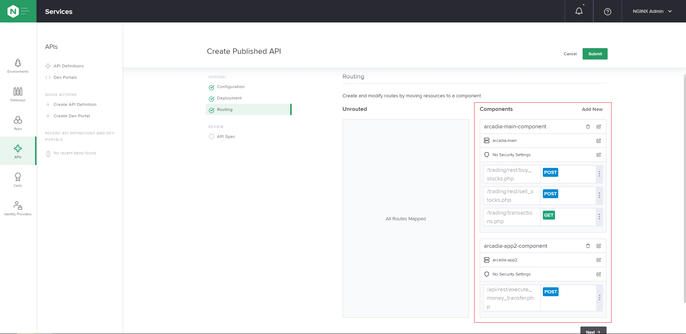
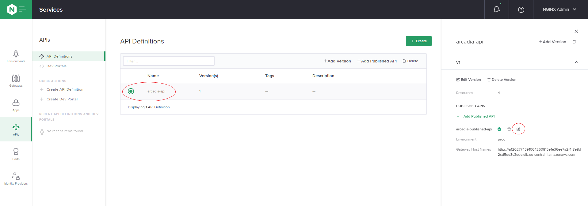
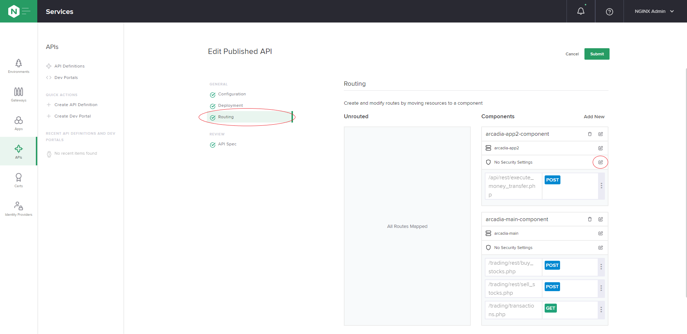

## The Nginx Controller

We have finished the first part of the publishing our application, now we want to publish our APIs to be used by third party organizations.  
We will acomplish this using two components:
- Nginx Controller which will be used as an API Management
- Nginx Container will be the API Microgateway which will reside within the Kubernetes environment


1. The Nginx Controller has already been deployed with the terraform declaration, we need to find the public IP address.

<pre>
Command:
cd terraform
terraform refresh
terraform output controller_ip

Output:
52.151.70.150    
</pre>

2. Change the directory back to the original repo folder:
```
cd ..
```

3. Browse (using `HTTPS`) to the IP address of the Controller:

```
Username (email): nginx@f5.com
Password: Admin2020
```

4. Get the API key of the Nginx controller to connect the microgateway so it is managed by the controller.
Once you login - the first thing you will see is the API key, save it for later.


5. Deploy the microgateway with the following configuration.  

:warning: Please note: you need to replace the IP address of the controller and the API key value you saved in the previous step.
:warning: Please note: you need to replace the `RANDOM GENERATED NUMBER` value with the specific value.
Create a new file `microgw.yaml`:

<pre>
apiVersion: apps/v1
kind: Deployment
metadata:
  name: microgateway
spec:
  replicas: 1
  selector:
    matchLabels:
      app: microgateway

  template:
    metadata:
      labels:
        app: microgateway
    spec:
      containers:
        - name: microgateway1
          image: sorinboia/ngtest:3.4
          imagePullPolicy: Always
          env:
            - name: API_KEY
              value: [REPLACE WITH THE API KEY]
            - name: CTRL_HOST
              value: [REPLACE WITH CONTROLLER IP ADDRESS]
            - name: HOSTNAME
              value: microgateway1            
          ports:
            - containerPort: 80
          readinessProbe:
            exec:
              command:
                - curl
                - 127.0.0.1:49151/api
            initialDelaySeconds: 5
            periodSeconds: 5
            
---

apiVersion: v1
kind: Service
metadata:
  name: microgateway
  annotations:
    service.beta.kubernetes.io/azure-dns-label-name: micro-[RANDOM GENERATED NUMBER]    
spec:
  selector:
    app: microgateway
  ports:
    - port: 80
      targetPort: 80
      name: http
    - port: 443
      targetPort: 443
      name: https
  externalTrafficPolicy: Local
  type: LoadBalancer
</pre>

From now on we will only use the Controller GUI do to all of our configuration.  
The end goal will be to expose and protect our APIs both internally within the cluster and externally to other programmers.  

6. Login to the Nginx Controller web UI, click the "N" button in the upper left corner and go to "Infrastructure" -> "Instances".  

You will see the microgateway we just deployed listed. If it is not there wait for about 2 minutes, it might take a little bit of time for the instance to register.

7. The hostname of the microgateway service we just published, will have the following format `micro-[RANDOM GENERATED NUMBER].uksouth.cloudapp.azure.com` .  

8. Build the configuration:
##### "N" -> "Services" -> "Environments" -> "Create Environment"  
In all the fields, enter the following value: `prod`.

Click on "View API Request".  
All the configuration on the Nginx Controller can be easlly automated with external orchestration systems, this view can help you in understanding how to generate the configuration API calls.  

The output will look like this:
<pre>
{
  "metadata": {
    "name": "prod",
    "displayName": "prod",
    "description": "prod",
    "tags": [
      "prod"
    ]
  },
  "desiredState": {}
}
</pre> 

Click "Submit".

9. Create the Certificate:  

##### "N" -> "Services" -> "Certs" -> "Create Cert"
> Name: server-cert   
> Environment: prod  
> Chose "Copy and paste PEM text"  
> Private Key: Browse to https://raw.githubusercontent.com/sorinboia/nginx-experience-azure/master/certs_for_mtls/ca.key copy and paste.  
> Public Cert: Browse to https://raw.githubusercontent.com/sorinboia/nginx-experience-azure/master/certs_for_mtls/ca.pem copy and paste.  
> Submit

10. Create the Gateway:  

##### "N" -> "Services" -> "Gateways" -> "Create Gateway"
> Name: api.arcadia.azure.cloud  
> Environment: prod  
> Instance Refs: Select All  
> Hostname: https://micro-[RANDOM GENERATED NUMBER].uksouth.cloudapp.azure.com  
> Cert Reference: server-cert  
> Submit


11. Create the App: 

##### "N" -> "Services" -> "Apps" -> "Create App"
> Name: arcadia-api   
> Environment: prod  
> Submit

  
  
So far we have created an environment, uploaded the certificate/key that we will use for our HTTPS connection, created a gateway which represents our entry point into the API gateway and last defined a new application object.  
  
  
Next we are going to publish the application APIs to the world.   
There are two ways of creating this configuration, the first one is manual similar to the way we performed the configuration until this point and the second one is described bellow.  


As part of their development cycle, the developers of the Arcadia application are generating an [OpenApi](https://swagger.io/docs/specification/about/) specification to describe their APIs.  
We are going to use this API specification in order to publish the services to the world.

12. Run the following curl commands.  

:warning: Please note: you need to replace the IP address of the controller.  

<pre>
Commands:
curl -k -sc cookie.txt -X POST --url "https://[CHANGE TO CONTROLLER IP ADDRESS]/api/v1/platform/login" --header 'Content-Type: application/json' --data '{"credentials": {"type": "BASIC","username": "nginx@f5.com","password": "Admin2020"}}'  
curl -k -sb cookie.txt -c cookie.txt --location --request PUT "https://[CHANGE TO CONTROLLER IP ADDRESS]/api/v1/services/api-definitions/arcadia-api/versions/v1" --header 'Content-Type: application/json' --header 'Content-Type: text/plain' --data "@files/6controller/arcadia_api_spec.json"
</pre>

We have just uploaded the OpenApi spec to the Nginx Controller.  

13. Go to "N" -> "Services" -> "APIs" -> "API Definitions".  
You can see the "Arcadia API" definition listed.  

Click the "Pen" icon of the "Arcadia API" and you can see a list of the defined API endpoints.  
 
14. Check the DNS name of the backend servers we need to point our APIs to:
 <pre>
 Command:
 kubectl get svc
 
 Output:
 NAME              TYPE           CLUSTER-IP     EXTERNAL-IP   PORT(S)                      AGE
 arcadia-app2      ClusterIP      10.0.240.156   none          80/TCP                       3h26m
 arcadia-app3      ClusterIP      10.0.62.5      none          80/TCP                       3h26m
 arcadia-backend   ClusterIP      10.0.9.117     none          80/TCP                       65m
 arcadia-main      ClusterIP      10.0.63.54     none          80/TCP                       3h26m
 backend           ClusterIP      10.0.123.222   none          80/TCP                       3h26m
 kubernetes        ClusterIP      10.0.0.1       none          443/TCP                      4h8m
 microgateway      LoadBalancer   10.0.240.6     51.11.15.56   80:32742/TCP,443:32397/TCP   8m
 </pre>

We are interested in "main" and "app2" and their DNS names are `arcadia-main` and `arcadia-app2`.

15. Publish the API
##### “N” -> “Services” -> “APIs” -> Click “arcadia-api” -> Click “Add Published API”


> Published API Name: arcadia-published-api  
> Click Next  
> Environment: prod  
> Application: arcadia-api  
> Gateways: api.arcadia.azure.cloud  
> Click Next


15.1  We will now add the components that represent the workload for the main app that traffic will be sent to.
##### Click “Add New” on the “Components” column and fill the data as described bellow

> Name: arcadia-main-component  
> Click Next  
> Workload Group Name: arcadia-main-wl  
> URI: http://arcadia-mai  
> Click Submit  

15.2 Add the second component that represents the workload for app2
##### Click “Add New” on the “Components” column and fill the data as described bellow

> Name: arcadia-app2-component  
> Workload Group Name: arcadia-app2-wl  
> URI: http://arcadia-app2  
> Click Submit

16. Move the routes that start with “/api” in the “Unrouted” to the “Components” column under the “arcadia-app2-component”. Move the remaining routes under “arcadia-main-component” and click Submit


17. We have finished publishing the API all is left is to test it. Run the bellow curl command, you should receive a success message and if you go to the main Arcadia application and refresh the page you will be able to see the transaction we just did in the “Transfer History” section.

> curl -k --location --request POST https://micro-[RANDOM GENERATED NUMBER].uksouth.cloudapp.azure.com/api/rest/execute_money_transfer.php --header 'Content-Type: application/json' --data-raw '{"amount":"77","account":"2075894","currency":"EUR","friend":"Alfredo"}'

example output:
{"name":"Alfredo", "status":"success","amount":"77", "currency":"EUR", "transid":"944962065", "msg":"The money transfer has been successfully completed "}


REMOVE? 22. Instruct kubernetes to point to the microgateway instead of directly to the pods.
<pre>
cat << EOF | kubectl apply -f -
apiVersion: v1
kind: Service
metadata:
  name: backend
  labels:
    app: microgateway
spec:
  ports:
  - port: 80
    targetPort: 80
    protocol: TCP
  selector:
    app: microgateway
EOF
</pre>


All looks good but we are not done, we should add some security to our API and enable access with access keys.

19. Create an Identity Provider:

##### “N” -> “Services” -> “Identity Provider” -> “Create an Identity Provider”
> Name: api-protect  
> Environment: prod  
> Type: API Key

Create.

Under “API Clients”
> Name: test-client  
> Key: 1234567890  
> Click: Submit


Copy the key that was just created and save it for later.

20. Go the the edit mode of APIs we have previously published

##### “N” -> “Services” -> “APIs” -> Click “arcadia-api” -> Click the edit icon


Attach the new Identity Provider to the APIs
> Click: “Routing”  
> Click: the edit icon of “arcadia-app2-component” component security setting  



21. Click “Add Authentication” and fill in the fields

> Identity Provider: api-protect 
> Credential Location: Header  
> Credentials Value: apikey  
> Click: Done  
> Click: Submit  
> Click Submit again on the “Edit Published API” page

22. Check that the authentication is failing when not providing an API key

> curl -k --location --request POST https://micro-[RANDOM GENERATED NUMBER].uksouth.cloudapp.azure.com/api/rest/execute_money_transfer.php --header 'Content-Type: application/json' --data-raw '{"amount":"77","account":"2075894","currency":"EUR","friend":"Alfredo"}'
expected output:
<pre>
<html>
<head><title>401 Authorization Required</title></head>
<body>
<center><h1>401 Authorization Required</h1></center>
<hr><center>nginx</center>
</body>
</html>
</pre>

23. Try again but this time including the API key and the test-client value
> curl -k --location --request POST https://micro-[RANDOM GENERATED NUMBER].uksouth.cloudapp.azure.com/api/rest/execute_money_transfer.php --header "apikey: 1234567890" --header 'Content-Type: application/json' --data-raw '{"amount":"77","account":"2075894","currency":"EUR","friend":"Alfredo"}'

example output:
{"name":"Alfredo", "status":"success","amount":"77", "currency":"EUR", "transid":"944962065", "msg":"The money transfer has been successfully completed "}


### Summary

All of our microgateway API configuration is complete.  
We have published both external and internal APIs and are able to gather and view statistics for traffic coming from external clients and also internally when one service is contacting another. We have achieved the bellow architecture: 


#### [Next part](7security.md)
